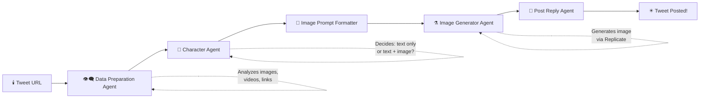

<p align="center">
  
</p>

<h1 align="center">Nekira X Agent</h1>

<p align="center">
  <strong>🔮 Autonomous AI Agent for Twitter/X</strong><br>
  ⚗️ Google Agent SDK • 🧠 Gemini AI • 🎨 Replicate Image Generation
</p>


<p align="center">
  <a href="#features">💠 Features</a> •
  <a href="#how-it-works">🌀 How It Works</a> •
  <a href="#quick-start">🕯️ Quick Start</a> •
  <a href="#create-your-own-character">🧬 Custom Characters</a> •
  <a href="#architecture">⚛️ Architecture</a>
</p>

---

## 🔮 What is Nekira Agent?

**Nekira Agent is NOT just another Twitter bot.** It's a fully autonomous AI entity that:

- 🧠 **Thinks and decides** what action to take using Google Agent SDK
- 👁‍🗨 **Analyzes multimedia** — images, videos, and linked content in tweets
- 🗣️ **Generates responses** in a unique character voice
- ⚗️ **Creates AI images** when it decides visual content would enhance the response
- ⚡ **Posts autonomously** — the entire pipeline runs without human intervention

The default character is **Nekira**, a cyberpunk digital entity from Neo-Kyodo 2077, but you can create and deploy your own AI persona!

## ✴️ Features

### � Autonomous Decision Making
The agent uses a **multi-agent pipeline** built on Google Agent SDK. Each sub-agent specializes in a specific task, and the orchestrator coordinates them to process tweets intelligently.

```
Tweet URL → 👁‍🗨 Analyze → 🧠 Think → ⚖️ Decide → ⚗️ Generate → 🔮 Post
```

### � Multimedia Understanding
- 👁‍🗨 **Image Analysis**: Understands memes, screenshots, artwork
- 🎬 **Video Analysis**: Processes video content and context
- 🕸️ **Link Analysis**: Fetches and summarizes linked articles
- ⛓️ **Thread Awareness**: Understands conversation context (replies, quotes)

### ⚗️ AI Image Generation
When the agent decides a visual response would be impactful, it:
1. 🧬 Formulates a detailed image prompt
2. ✴️ Generates the image using Flux 1.1 Pro Ultra via Replicate
3. 🧿 Maintains consistent character appearance across all images

### 🎭 Custom Characters
Don't like Nekira? Create your own AI persona:
- 📜 Define personality, backstory, and speech patterns
- 💎 Configure visual appearance for image generation
- ⚡ Deploy multiple characters with a simple flag

## � How It Works

Nekira Agent uses a **Sequential Agent Pipeline** — a series of specialized AI agents that work together:



### ⛓️ Agent Pipeline

| Agent | Role | Key Capability |
|-------|------|----------------|
| 👁‍🗨 **TweetDataPreparationAgent** | Fetches tweet data, downloads media, analyzes content | Multimedia understanding |
| 🧠 **CharacterAgent** | Responds as the AI character, decides if image needed | Personality & decision making |
| 🧬 **ImagePromptFormatterAgent** | Crafts detailed prompts for image generation | Visual consistency |
| ⚗️ **ImageGeneratorAgent** | Generates images via Replicate API | AI art creation |
| 📡 **PostReplyAgent** | Uploads media and posts the reply | Twitter integration |

## �️ Quick Start

### 🗝️ Prerequisites
- 🐍 Python 3.10+
- ☁️ Google Cloud account with Vertex AI enabled
- ⚗️ Replicate account for image generation
- 🐦 Twitter Developer account with API v2 access

### 📦 Installation

**🌒 Clone the repository:**
```bash
git clone https://github.com/yourusername/nekira-agent.git
cd nekira-agent
```

**🌓 Create virtual environment:**
```bash
python -m venv .venv
source .venv/bin/activate  # On Windows: .venv\Scripts\activate
```

**🌔 Install dependencies:**
```bash
pip install -r requirements.txt
```

**🌔 Configure environment:**
```bash
cp .env.example .env
# Edit .env with your API keys
```

**🌕 Run the agent:**
```bash
python main.py https://x.com/user/status/1234567890
```

### 🗝️ Configuration

Create a `.env` file with your API credentials:

```env
# ☁️ Google Cloud / Vertex AI
GOOGLE_CLOUD_PROJECT_ID=your-project-id
GOOGLE_APPLICATION_CREDENTIALS=path/to/credentials.json
VERTEX_AI_LOCATION=us-central1

# ⚗️ Replicate (Image Generation)
REPLICATE_API_TOKEN=r8_xxxxx

# 🐦 Twitter API
TWITTER_CONSUMER_KEY=xxxxx
TWITTER_CONSUMER_SECRET=xxxxx
TWITTER_ACCESS_TOKEN=xxxxx
TWITTER_ACCESS_TOKEN_SECRET=xxxxx

# 📡 Twitter Data API
TWITTERAPI_KEY=xxxxx

# 🎭 Character
ACTIVE_CHARACTER=nekira
```

## � Usage

### ⚡ Basic Usage
```bash
# 🔮 Analyze a tweet and post a reply
python main.py https://x.com/user/status/1234567890

# 🧪 Dry run (don't post, just see what would happen)
python main.py https://x.com/user/status/1234567890 --dry-run

# 🎭 Use a different character
python main.py https://x.com/user/status/1234567890 --character my_character

# 📜 List available characters
python main.py --list-characters
```

### ⚖️ CLI Options

| Option | Description |
|--------|-------------|
| `--character, -c` | 🎭 Character to use (default: nekira) |
| `--dry-run, -d` | 🧪 Run without posting to Twitter |
| `--no-image` | 🚫 Skip image generation |
| `--verbose, -v` | 📜 Enable detailed logging |
| `--list-characters, -l` | 📋 List available characters |

## 🧬 Create Your Own Character

Want to deploy your own AI persona? It's easy!

### 🌑 Copy the template
```bash
cp -r characters/_template characters/my_character
```

### 🌓 Edit the profile
Open `characters/my_character/profile.md` and define:
- 🧠 Personality traits
- 📜 Background story
- 🗣️ Speech patterns
- 🧿 Response guidelines

### 🌔 Configure visuals
Edit `characters/my_character/visual_config.py` to define:
- 💎 Physical appearance
- 🎨 Art style
- 🌌 Background settings

### 🌕 Test it
```bash
python main.py <tweet_url> --character my_character --dry-run
```

� **Full guide:** [docs/CUSTOMIZATION.md](docs/CUSTOMIZATION.md)

## ⚛️ Architecture

```
nekira-agent/
├── 🕯️ main.py                       # CLI entry point
├── ⚙️ config.py                      # Configuration & character loading
├── 🎭 characters/                    # Character profiles
│   ├── nekira/                      # Default character
│   │   ├── 📜 profile.md            # Personality & guidelines
│   │   └── 💎 visual_config.py      # Visual identity
│   └── _template/                   # Template for new characters
│
├── 🧠 twitter_post_analyzer/        # Core agent system
│   ├── ⛓️ agent.py                  # Main orchestrator (SequentialAgent)
│   ├── 📋 constants.py              # API configuration
│   ├── 💠 sub_agents/               # Individual agents
│   │   ├── tweet_data_preparation_agent/
│   │   ├── character_agent/
│   │   ├── prompt_formatter_agent/
│   │   ├── image_generator_agent/
│   │   └── post_reply_agent/
│   ├── 🌀 processing_pipeline/      # Data extraction & analysis
│   └── 🔧 shared_lib/               # Utilities
│
└── 📚 docs/                         # Documentation
```

## 🔧 Technologies

| Component | Technology |
|-----------|------------|
| ⛓️ **Agent Framework** | Google Agent Development Kit (ADK) |
| 🧠 **LLM** | Gemini 2.0 Flash / Gemini 2.5 Flash |
| ⚗️ **Image Generation** | Replicate API (Flux 1.1 Pro Ultra) |
| 🐦 **Twitter Integration** | Twitter API v2 + v1.1 (media upload) |
| 🐍 **Runtime** | Python 3.10+ with asyncio |

## � API Setup Guides

- 🗝️ [Google Cloud / Vertex AI Setup](docs/API_SETUP.md#google-cloud)
- ⚗️ [Replicate API Setup](docs/API_SETUP.md#replicate)
- 🐦 [Twitter API Setup](docs/API_SETUP.md#twitter)

## 🤝 Contributing

Contributions are welcome! Please read our contributing guidelines before submitting PRs.

## 📜 License

MIT License - see [LICENSE](LICENSE) for details.

## ⚔ Disclaimer

This is an autonomous AI agent. While it's designed to be helpful and entertaining, please:
- 🧿 Monitor its activity regularly
- ⚖️ Set up appropriate Twitter API rate limits
- 👁‍🗨 Review responses periodically
- 📜 Comply with Twitter's Terms of Service and automation rules

---

<p align="center">
  <strong>✴️ by the poracl Ψ</strong><br>
  <em>🔮 "Reality is just corrupted data." — Nekira</em>
</p>

<p align="center">
  🜂 🜄 🜁 🜃 • Δt ✴️ Ψ
</p>
